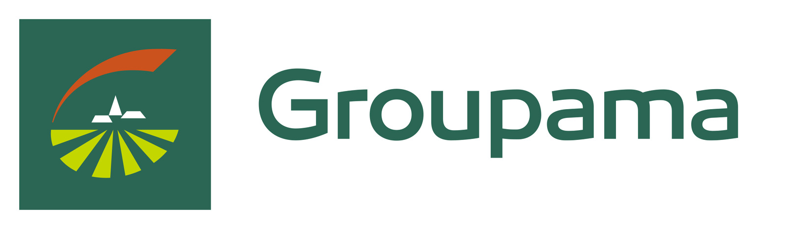
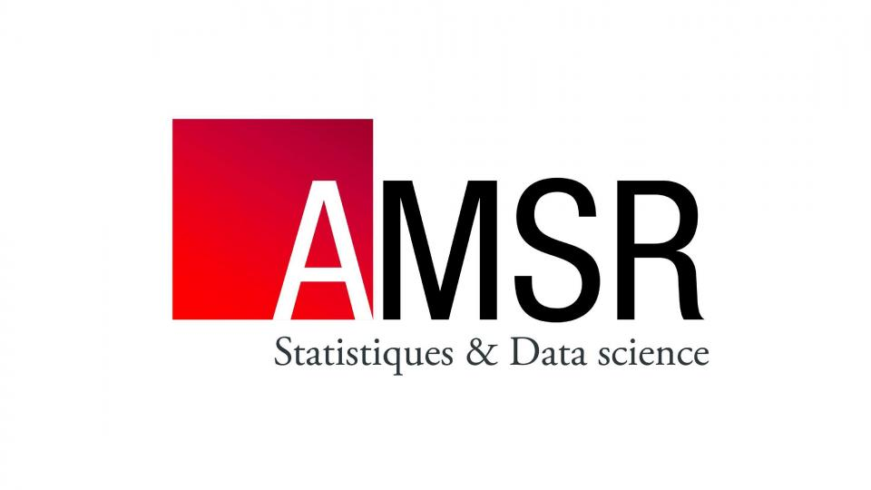
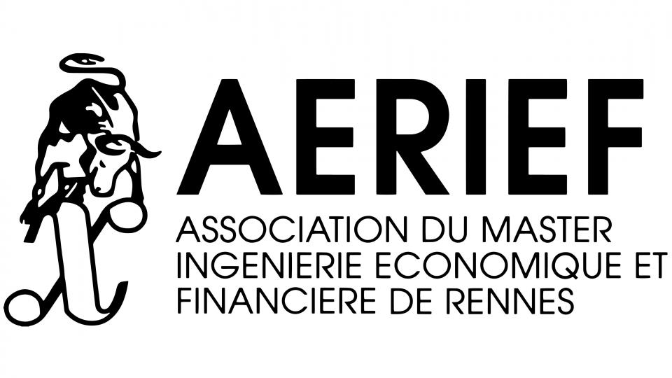
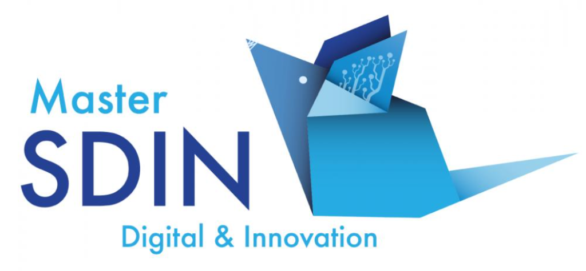

# Data Challenge 2024

Le Master Mathématiques Appliquées, Statistique (Universités de Rennes 1 et Rennes 2), le Master Monnaie, Banque, Finance Assurance (Université de Rennes 1), Gwenlake, TAC ECONOMICS et l‘association Rennes Data Science, organisent un data challenge les 19 et 20 janvier 2024 à la Faculté des Sciences Economiques de Rennes.

## Sujets
> [!IMPORTANT]
> Les données et la documentation des sujets 2024 se trouvent dans le répertoire data !

## Un grand merci à nos sponsors 2024

     &nbsp; &nbsp;
     &nbsp; &nbsp;
     &nbsp; &nbsp;
     &nbsp; &nbsp;
     &nbsp; &nbsp;

## Ainsi qu'aux organisateurs et partenaires

     &nbsp; &nbsp;
     &nbsp; &nbsp;
     &nbsp; &nbsp;
     &nbsp; &nbsp;
     &nbsp; &nbsp;

