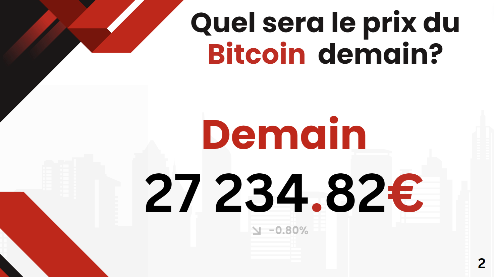
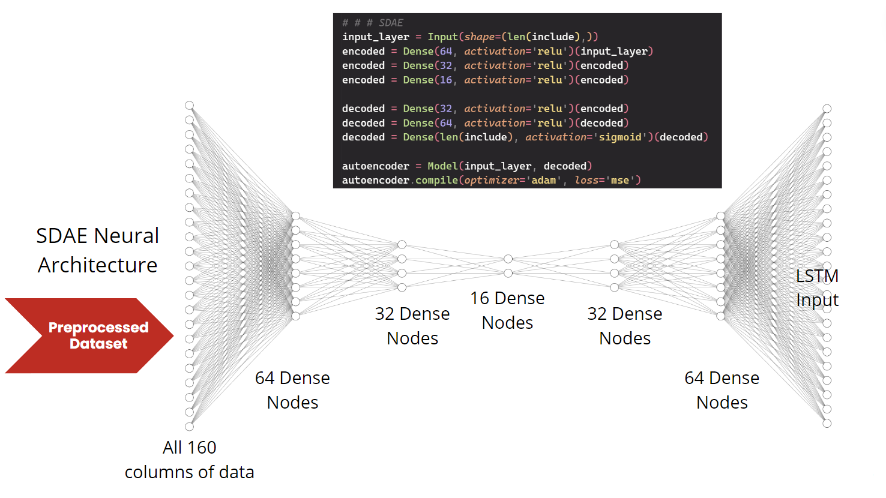
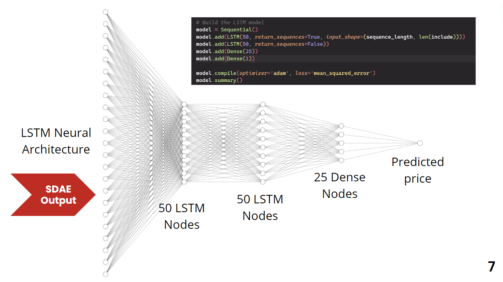

# 🏆 Winner of the Innovation Prize



# Data Challenge 2024

Le Master Mathématiques Appliquées, Statistique (Universités de Rennes 1 et Rennes 2), le Master Monnaie, Banque, Finance Assurance (Université de Rennes 1), Gwenlake, TAC ECONOMICS et l'association Rennes Data Science, organisent un data challenge les 19 et 20 janvier 2024 à la Faculté des Sciences Economiques de Rennes.

# Prévision marché Crypto-monnaies avec des réseaux de neurones récurrents



---



## Objectifs

- Prévoir à court terme les prix et les rendements des 11 principales crypto-monnaies.
- Battre la gestion passive "buy and hold".
- Réduire la volatilité.

## Rendu du projet

Nos modèles:

- [Modèle RNN LSTM Bitcoin](src/models/BTC.ipynb)
- [Modèle RNN LSTM Etherium](src/models/ETH.ipynb)
- [Modèle RNN LSTM Cardano](src/models/ADA.ipynb)
- [Modèle RNN LSTM Binance Coin](src/models/BNB.ipynb)
- [Modèle RNN LSTM Doge Coin](src/models/DOGE.ipynb)
- [Modèle RNN LSTM Polkadot](src/models/DOT.ipynb)
- [Modèle RNN LSTM Litecoin](src/models/LTC.ipynb)
- [Modèle RNN LSTM Solana](src/models/SOL.ipynb)
- [Modèle RNN LSTM XRP](src/models/XRP.ipynb)
- [Modèle RNN LSTM Polygon](src/models/MATIC.ipynb)
- [Modèle RNN LSTM Shiba Inu](src/models/SHIB.ipynb)
- [Modèle RNN LSTM Bitcoin Cash](src/models/BCH.ipynb)

Architecture du projet:

- Le code est dans le dossier [`src`](src/)
- Les `outputs` dans le bon format sont dans le dossier [`data/output`](data/output/)

<!-- ### Résultats de nos modèles

| Crypto-monnaie | Rendement de notre Modèle | Rendement du modèle "buy and hold" |
| :------------: | :-----------------------: | ---------------------------------- |
|    Bitcoin     |           +35%            | +36%                               |
|    Ethereum    |           +12%            | +10%                               |
|  Binance Coin  |           -13%            | +15%                               |
|    Litecoin    |           -42%            | +62%                               |
|    Dogecoin    |           -34%            | +19%                               |
|  Bitcoin Cash  |           +30%            | + 5%                               |
|     Ripple     |           +46%            | +27%                               |
| Polygon MATIC  |           -22%            | +24%                               |
|  Cardano ADA   |            -5%            | -21%                               |
|   Polka Dot    |           +20%            | -16%                               |
|     Solana     |           +44%            | -34%                               |
|   Shiba Inu    |           +0.1%           | -13%                               | -->

## Structure du projet

```
datachallenge2024
├─ data       // data files
│  └─ output  // outputs files
├─ img        // assets files
├─ README.md
└─ src
  ├─ models
  │  ├─ ADA.ipynb
  │  ├─ BCH.ipynb
  │  ├─ BNB.ipynb
  │  ├─ BTC.ipynb
  │  ├─ DOGE.ipynb
  │  ├─ DOT.ipynb
  │  ├─ ETH.ipynb
  │  ├─ LTC.ipynb
  │  ├─ MATIC.ipynb
  │  ├─ SHIB.ipynb
  │  ├─ SOL.ipynb
  │  └─ XRP.ipynb
  ├─ tests // other models we tried
  └─ utils // utils files scripts
```

## À noter

- La valorisation fondamentale des crypto-actifs est plus complexe et incertaine par rapport à une entreprise qui peut générer des revenus.
- Fuseau horaire UTC.
- Période de données : août 2017 à avril 2023.
- Les prix de clôture sont relevés à 23h59 UTC.
- L'indicateur de prévision varie de -1 à 1 (1 étant très optimiste).

## Consignes

- Prévoir sur une période d'un jour.
- Fournir des prévisions pour au moins 5 crypto-monnaies.
- Effectuer un backtest.
- La période allant d'août 2017 à août 2022 est réservée à la modélisation.
- La période de septembre 2022 à avril 2023 sera utilisée pour les tests (prévisions en dehors de l'échantillon).

## Crypto-monnaies

1. Bitcoin (BTC)
2. Ethereum (ETH)
3. Binance Coin (BNB)
4. Litecoin (LTC)
5. Dogecoin (DOGE)
6. Bitcoin Cash (BCH)
7. Ripple (XRP)
8. Polygon MATIC (MATIC)
9. Cardano ADA (ADA)
10. Polka Dot (DOT)
11. Solana (SOL)

- Proof of Stake (PoS): Ethereum, Cardano, Polka Dot, Solana
- Proof of Work (PoW): Les autres

## Catégories de portefeuilles

- **Vert**: Des crypto-monnaies basées sur la preuve d'enjeu (PoS) : ETH, ADA, DOT, SOL (et éventuellement AVAX).
- **Faible risque\***: Combinaison des 5 crypto-monnaies présentant la plus faible volatilité. Une analyse sera effectuée sur toutes les combinaisons possibles de 5 crypto-monnaies.
- **Performance**: Combinaison des 5 crypto-monnaies ayant généré le plus de plus-values cumulées. Une analyse sera effectuée sur toutes les combinaisons possibles de 5 crypto-monnaies.
- **DeFi**: Soutenir des projets axés sur la finance décentralisée et la société : UNI, LINK, AAVE.
- Élimination des crypto-monnaies associées à des fraudes connues.

---

## Un grand merci à nos sponsors 2024

<p align="center">
    <a href="https://www.enedis.fr" target="_blank"></a> &nbsp; &nbsp;
    <a href="https://www.groupama.fr/" target="_blank"></a> &nbsp; &nbsp;
    <a href="https://www.federal-finance-gestion.fr" target="_blank"></a> &nbsp; &nbsp;
    <a href="https://fondation.univ-rennes.fr/" target="_blank"></a> &nbsp; &nbsp;
    <a href="https://www.gwenlake.com/" target="_blank"></a> &nbsp; &nbsp;
</p>

## Ainsi qu'aux organisateurs et partenaires

<p align="center">
    <a href="https://eco.univ-rennes.fr/amsr" target="_blank"></a> &nbsp; &nbsp;
    <a href="https://eco.univ-rennes.fr/aerief" target="_blank"></a> &nbsp; &nbsp;
    <a href="https://eco.univ-rennes.fr/aser" target="_blank"></a> &nbsp; &nbsp;
    <a href="https://www.univ-rennes.fr/" target="_blank"></a> &nbsp; &nbsp;
    <a href="https://taceconomics.com" target="_blank"></a> &nbsp; &nbsp;
</p>
